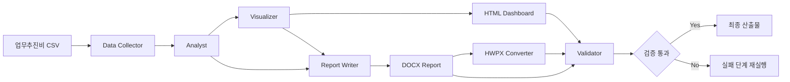
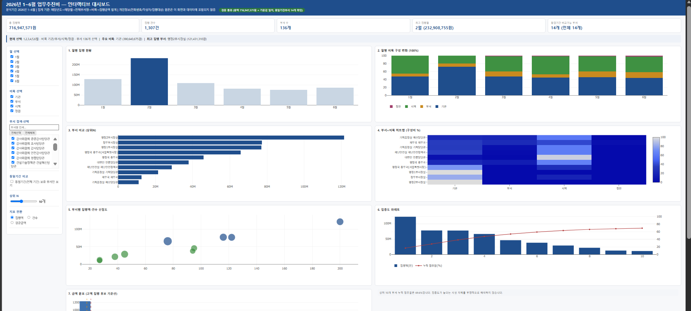
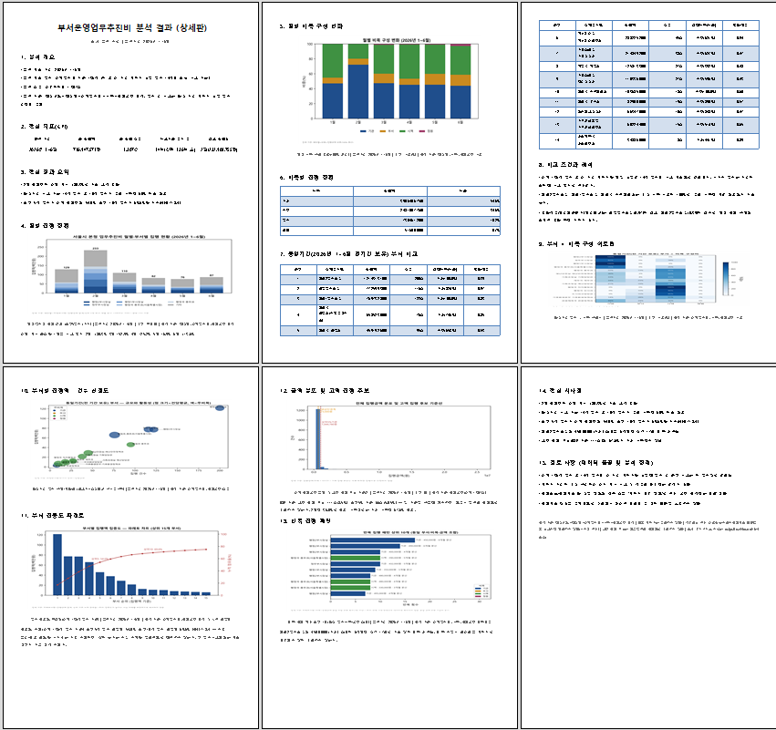
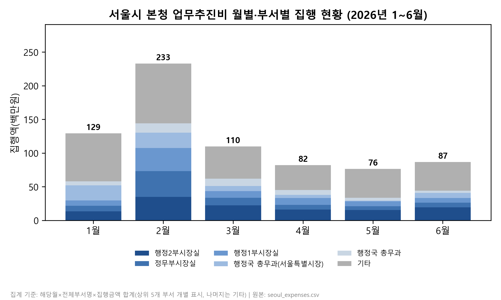
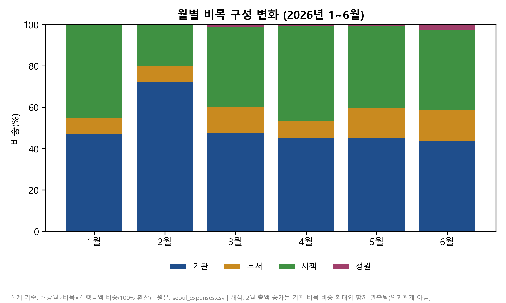
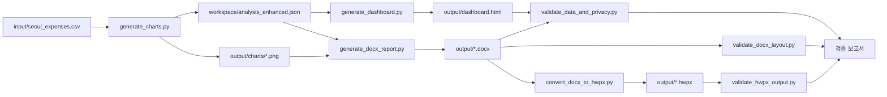

# 서울시 본청 부서운영업무추진비 분석·보고서 생성기

### Seoul Department Operating Expense Report Generator

서울시 본청 부서운영업무추진비 CSV를 분석하여 **인터랙티브 HTML 대시보드**, **DOCX 상세 보고서**, **HWPX 상세 보고서** 및 **검증 보고서**를 생성하는 보고서 자동화 프로젝트입니다.

> GitHub 저장소명: `seoul-department-operating-expense-report`

---

## 개요

원본 CSV(집행 건별 라인아이템)를 정제 없이 읽어 연도→월→부서→비목 기준으로 집계·분석하고, 그 결과를 다음 4종의 산출물로 변환합니다.

| 산출물 | 형식 | 용도 |
|---|---|---|
| 인터랙티브 대시보드 | HTML (Plotly, 오프라인 실행 가능) | 필터·KPI·자동 해석문을 갖춘 상세 탐색용 자료. GitHub Pages로도 공개 가능 |
| 상세 보고서 | DOCX | 표·차트 포함 다페이지 문서 |
| 상세 보고서 | HWPX | 한컴오피스 환경 배포용 (DOCX를 한컴오피스 자동화로 변환, 선택 기능) |
| 검증 보고서 | Markdown | 원본 데이터 ↔ 분석 결과 ↔ 산출물 간 수치 교차검증, 개인정보 노출 검사 |

모든 분석 수치는 원본 CSV에서 직접 재계산해 교차검증하며, 원본 데이터에 없는 금액·원인·의도는 추정하지 않습니다. 자세한 원칙은 [docs/analysis_rules.md](docs/analysis_rules.md)를 참조하세요.

## 하네스 구성

이 프로젝트는 CSV를 읽어 보고서를 뽑아내는 단일 스크립트가 아니라, **역할이 분리된 에이전트가 정해진 순서로 산출물을 주고받고, 각 단계의 결과를 검증하는 하네스(harness)** 구조로 설계되어 있습니다.

- **수치 계산**: 모든 집계·통계는 Python(pandas)이 결정론적으로 계산합니다. 어떤 단계에서도 LLM이 수치를 추정하거나 생성하지 않습니다.
- **하네스가 통제하는 것**: 역할 분리(수집·분석·시각화·집필·변환·검증), 실행 순서, 단계 간 산출물 전달(`workspace/analysis_enhanced.json`을 단일 소스로 공유), 실패 시 처리(예: HWPX 변환 실패해도 HTML·DOCX는 그대로 유지), 각 단계 산출물의 자동 검증.
- **과장하지 않는 부분**: 현재 구현은 에이전트 간 실시간 LLM 대화나 모델 티어(소형/대형 모델 라우팅 등)를 사용하지 않습니다. 각 "에이전트"는 명확한 책임을 가진 결정론적 Python 스크립트이며, 오케스트레이터(`run_pipeline.py`)가 순서·조건부 실행·검증 호출을 관장합니다.

### 에이전트 역할

| 역할 | 구현 파일 | 책임 |
|---|---|---|
| Data Collector·Analyst | `scripts/generate_charts.py` | CSV 정제, 월·부서·비목별 분석 |
| Visualizer | `scripts/generate_charts.py`, `scripts/generate_dashboard.py` | PNG 차트, HTML 대시보드 |
| Report Writer | `scripts/generate_docx_report.py` | DOCX 보고서 |
| Format Converter | `scripts/convert_docx_to_hwpx.py` | HWPX 변환 |
| Validator | `scripts/validate_*.py` | 수치·개인정보·레이아웃·HWPX 검증 |
| Orchestrator | `scripts/run_pipeline.py` | 전체 실행과 오류 처리 |

### 핸드오프(Handoff)

| 송신 역할 | 수신 역할 | Payload | Trigger |
|---|---|---|---|
| Data Collector | Analyst | 정제 데이터 | 입력 검증 통과 |
| Analyst | Visualizer | 분석 JSON·집계표 | 분석 완료 |
| Analyst·Visualizer | Report Writer | 지표·차트 | 차트 생성 완료 |
| Report Writer | Format Converter | DOCX | DOCX 생성 완료 |
| 각 생성 단계 | Validator | HTML·DOCX·HWPX | 산출물 생성 완료 |
| Validator | Orchestrator | 오류 위치·검증 결과 | 검증 완료 |

### 검증 루프

- **수치 오류**: 분석 또는 보고서 단계 재실행
- **개인정보 노출**: HTML·보고서 생성 단계 재실행
- **DOCX 레이아웃 오류**: DOCX만 재생성
- **HWPX 실패**: HTML·DOCX는 유지하고 HWPX만 재실행
- 검증 통과 후 최종 산출물 확정

### 입력 → 처리 → 검증 → 출력



## 과제 요구사항 대응

| 요구사항 | 이 프로젝트의 대응 | 근거 |
|---|---|---|
| AI Agent 업무처리 구조 | 역할별 에이전트(Data Collector/Analyst/Visualizer/Report Writer/Format Converter/Validator)와 오케스트레이터로 파이프라인 구성 | "하네스 구성", "에이전트 역할" |
| 입력 → 처리 → 검증 → 출력 | CSV 입력 → 분석/시각화/집필 처리 → Validator 검증 → 최종 산출물 출력의 4단계 흐름 | "입력 → 처리 → 검증 → 출력" 다이어그램 |
| Payload·Trigger·Handoff | 단계 간 전달 데이터(Payload)와 실행 조건(Trigger)을 명시 | "핸드오프(Handoff)" 표 |
| 바이브 코딩 활용 | Claude Code와의 대화형 반복 개발로 설계·통합·검증·GitHub 배포까지 단계별 승인을 거쳐 진행 | 본 저장소 전체(커밋 이력) |

## 실행 화면

### 인터랙티브 HTML 대시보드



### DOCX 상세 보고서



> HWPX 상세 보고서 및 대시보드 필터 단독 화면 캡처는 아직 준비되지 않았습니다. 캡처 방법은 [docs/screenshots/README.md](docs/screenshots/README.md)를 참조하세요.

## 미리보기 (대표 분석 차트)

| 월별·부서별 집행 현황 | 월별 비목 구성 변화 |
|---|---|
|  |  |

## 주요 기능

- **집계**: 해당년도→해당월→전체부서명→비목→집행금액 합계 기준 집계
- **동일기간 비교**: 전 기간 데이터를 보유한 부서끼리만 순위·구조 비교(기간이 다른 부서는 "비교 불가"로 표시)
- **심층 분석**: 월별 증감률, 비목 구성 변화, 부서 구조(비목 의존도·변동계수), 집중도(HHI·파레토), 고액 집행 후보(IQR/상위5% 구분), 반복 집행 패턴
- **시각화**: 8종 차트(월별 현황, 비목 구성, 부서 비교, 히트맵, 산점도, 파레토, 금액분포, 반복패턴) — 대시보드는 인터랙티브, 보고서는 정적 이미지
- **개인정보 비식별화**: 전화번호·작성자·집행대상 원문을 어떤 산출물에도 포함하지 않음(구조적으로 데이터 자체에서 제외)
- **자동 교차검증**: 원본 재계산 값과 산출물 내 수치를 스크립트로 자동 대조, 결과를 검증 보고서로 기록
- **재사용 가능한 파이프라인**: `--input`으로 다른 CSV를 지정해도 동작하도록 설계(단, 원본과 동일한 컬럼 스키마 필요)

## 설치

Python 3.10 이상.

```bash
pip install pandas matplotlib plotly python-docx adjustText pywin32
```

`pywin32`는 HWPX 변환(Windows + 한컴오피스 한글 전용 선택 기능)에만 필요합니다. Windows가 아니거나 한컴오피스가 없어도 HTML·DOCX 생성과 검증은 동일하게 동작합니다.

## 입력 데이터 배치

원본 CSV를 다음 경로에 위치시킵니다. (개인정보가 포함될 수 있어 저장소에는 커밋하지 않습니다 — `.gitignore` 처리됨.)

```
input/seoul_expenses.csv
```

필수 컬럼(원본 그대로): `문서고유id, 제목, 부서명, 전화번호, 작성자, 등록일, 해당년도, 해당월, 문서url, 구분(시장실만 사용), 전체부서명, 집행일시, 집행장소, 집행목적, 집행대상, 결제방법, 집행금액, 비목`

## 실행 방법

전체 파이프라인은 한 번에 실행할 수 있습니다.

```bash
python scripts/run_pipeline.py --input input/seoul_expenses.csv --formats html docx hwpx
```

원하는 형식만 선택할 수도 있습니다.

```bash
python scripts/run_pipeline.py --input input/seoul_expenses.csv --formats html docx
python scripts/run_pipeline.py --input input/seoul_expenses.csv --formats html
```

인자 없이 실행하면 사용법을 출력하고 종료합니다. 개별 스크립트 실행, 문제 해결 등 자세한 내용은 [docs/usage.md](docs/usage.md)를 참조하세요.

## 산출물 위치

| 경로 | 내용 |
|---|---|
| `workspace/analysis_enhanced.json` | 중간 분석 결과(집계·심층분석, 대시보드/DOCX 공통 소스) |
| `output/charts/*.png` | 보고서 삽입용 정적 차트 8종 |
| `output/dashboard.html` | 인터랙티브 대시보드 |
| `output/seoul_expense_executive_report.docx` / `.hwpx` | 최종 보고서 |
| `output/*_report.md`, `output/*_log.txt` | 검증 보고서 및 변환 로그 |

## 분석 기준 · 개인정보 처리

핵심만 요약합니다. 전체 원칙은 [docs/analysis_rules.md](docs/analysis_rules.md)를 참조하세요.

- 집계 단위: 해당년도 → 해당월 → 전체부서명 → 비목 → 집행금액 합계
- 부서 비교는 동일 기간 데이터를 보유한 부서끼리만 수행, 그렇지 않으면 "비교 불가"
- 고액 집행 건은 "고액 집행 후보"로만 표현, 오류·부적정으로 단정하지 않음
- `전화번호`·`작성자`·`집행대상` 원문은 어떤 산출물에도 포함하지 않음(대시보드는 데이터 자체에 미포함)

## 문서

| 문서 | 내용 |
|---|---|
| [docs/architecture.md](docs/architecture.md) | 전체 파이프라인 구조, 단계별 스크립트 역할, Mermaid 다이어그램 |
| [docs/workflow.md](docs/workflow.md) | 단계별 처리 흐름, 실패 처리 원칙 |
| [docs/analysis_rules.md](docs/analysis_rules.md) | 집계·비교·개인정보 처리 원칙 상세 |
| [docs/output_formats.md](docs/output_formats.md) | HTML/DOCX/HWPX/검증보고서 형식별 상세 구성 |
| [docs/usage.md](docs/usage.md) | 설치·실행·문제 해결 상세 가이드 |
| [docs/validation_summary.md](docs/validation_summary.md) | 최신 검증 결과 요약 |

## 프로젝트 구조

```
seoul-department-operating-expense-report/
├─ input/                   — 원본 CSV 배치 위치 (Git 제외)
├─ workspace/                — 중간 분석 산출물 (Git 제외, 재생성 가능)
├─ output/                    — 최종 보고서·대시보드·검증 결과 (Git 제외, 재생성 가능)
│  └─ charts/                 — 정적 차트 이미지
├─ scripts/                    — 파이프라인 스크립트 (8개, 아래 표 참조)
├─ docs/                        — 공개 문서 + GitHub Pages 소스
│  ├─ index.html                — GitHub Pages용 대시보드 사본
│  ├─ images/                   — README용 대표 차트(즉시 사용 가능)
│  └─ screenshots/               — README용 화면 캡처
├─ README.md
├─ LICENSE                       — Apache License 2.0
├─ requirements.txt
└─ .gitignore
```

### scripts/ 구성

| 스크립트 | 역할 |
|---|---|
| `generate_charts.py` | CSV 집계, 차트 8종 생성, `workspace/analysis_enhanced.json` 생성 |
| `generate_dashboard.py` | 인터랙티브 대시보드(`output/dashboard.html`) 생성 |
| `generate_docx_report.py` | DOCX 상세 보고서 생성 |
| `convert_docx_to_hwpx.py` | DOCX → HWPX 변환(Windows + 한컴오피스 전용) |
| `validate_data_and_privacy.py` | 원본 ↔ 분석결과 ↔ DOCX 수치 교차검증, 개인정보 노출 검사 |
| `validate_docx_layout.py` | DOCX 레이아웃 구조(여백·표·이미지) 정적 검증 |
| `validate_hwpx_output.py` | HWPX 재오픈·이미지보존·폰트보존 검증 |
| `run_pipeline.py` | 위 스크립트를 순서대로 실행하는 마스터 스크립트 |

## GitHub Pages 배포

1. 저장소 Settings → Pages → Source를 `main` 브랜치의 `/docs` 폴더로 설정합니다.
2. `docs/index.html`(대시보드 사본)이 `https://<사용자명>.github.io/<저장소명>/`에서 자동으로 열립니다.
3. 대시보드를 갱신했다면 `output/dashboard.html`을 다시 `docs/index.html`로 복사한 뒤 커밋합니다(자동 동기화 없음). 복사 전 개인정보·로컬 절대경로가 포함되지 않았는지 확인하세요(이 저장소의 `docs/index.html`은 확인 완료 상태입니다).

## 아키텍처

CSV 집계 → 인터랙티브 대시보드/DOCX 생성 → HWPX 변환 → 검증으로 이어지는 단계별 파이프라인 구조입니다. 각 단계는 독립된 스크립트로 구현되어 있고, 모든 수치는 코드 실행 결과만 인용합니다.



더 상세한 구조(단계별 스크립트 역할 표, 디렉터리 구조)는 [docs/architecture.md](docs/architecture.md)를, 실행 순서와 흐름은 [docs/workflow.md](docs/workflow.md)(시퀀스 다이어그램 포함)를 참조하세요.

> 이 프로젝트는 Harness-100의 **82 Report Generator Harness** 구조를 참고하여,
> 서울시 본청 부서운영업무추진비 분석·보고서 자동화 목적에 맞게
> 별도로 설계·구현했습니다.
>
> This project was independently designed and implemented for Seoul Metropolitan Government department operating expense analysis, referencing the architecture of Harness-100's **82 Report Generator Harness**.

## 라이선스

**Apache License 2.0**. 전문은 [LICENSE](LICENSE) 파일을 참조하세요.
