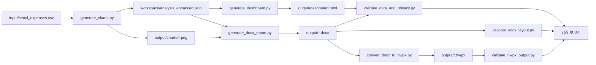

# 아키텍처

## 전체 파이프라인



## 파이프라인 단계별 역할

수치는 항상 코드 실행 결과만 인용하며, 서술은 그 결과를 바탕으로만 작성합니다(원칙 상세는 [analysis_rules.md](analysis_rules.md) 참조).

| 단계 | 역할 | 스크립트 |
|---|---|---|
| 데이터 집계 | CSV 로드·검증, 연도→월→부서→비목 집계, 심층 분석, 차트 8종 생성 | `generate_charts.py` |
| 대시보드 생성 | 인터랙티브 HTML 대시보드(필터·KPI·자동 해석문) 생성 | `generate_dashboard.py` |
| 보고서 집필 | DOCX 상세 보고서 생성 | `generate_docx_report.py` |
| 형식 변환 | DOCX → HWPX 변환(Windows + 한컴오피스 전용) | `convert_docx_to_hwpx.py` |
| 교차검증 | 원본↔분석결과↔산출물 수치 대조, 레이아웃 검증, 개인정보 노출 검사 | `validate_data_and_privacy.py`, `validate_docx_layout.py`, `validate_hwpx_output.py` |
| 전체 실행 | 위 단계를 형식 옵션(`--formats`)에 따라 순서대로 실행 | `run_pipeline.py` |

## 디렉터리 구조

```
seoul-department-operating-expense-report/
├─ input/               — 원본 CSV(로컬 전용, Git 제외)
├─ workspace/            — 중간 분석 산출물(로컬 전용, Git 제외)
├─ output/                — 최종 산출물(로컬 전용, Git 제외 — 재실행으로 재생성)
├─ scripts/                — 파이프라인 스크립트
└─ docs/                    — 공개 문서 + GitHub Pages 소스
```

## 데이터 흐름 원칙

- 모든 집계 수치는 `input/seoul_expenses.csv`에서 매 실행마다 직접 재계산하며, 캐시된 값을 신뢰하지 않습니다.
- `workspace/analysis_enhanced.json`이 분석 단계와 산출 단계(대시보드·DOCX) 사이의 단일 진실 소스입니다.
- 개인정보(전화번호·작성자·집행대상 원문)는 이 JSON과 모든 하위 산출물에 애초부터 포함하지 않습니다.
