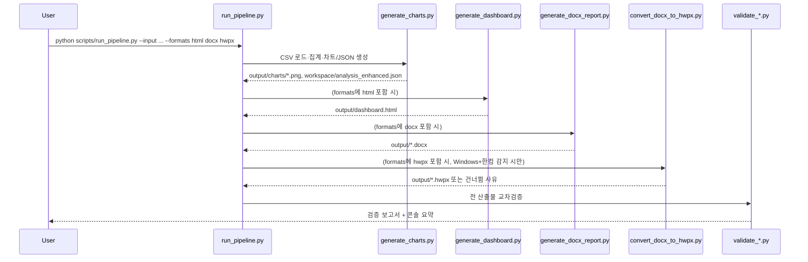

# 워크플로우

## 단계별 처리 흐름

## 실행 단위

1. **집계·시각화** (`generate_charts.py`): CSV를 읽어 연도→월→부서→비목 기준 집계, 8종 차트 PNG 생성, `analysis_enhanced.json` 저장. 모든 하위 단계의 공통 입력.
2. **대시보드** (`generate_dashboard.py`, `--formats`에 `html` 포함 시): CSV를 직접 읽어 필터·KPI·자동해석문을 갖춘 인터랙티브 HTML 생성. 브라우저 내 JS가 실시간으로 자체 수치 검증 배지를 표시.
3. **DOCX 보고서** (`generate_docx_report.py`, `--formats`에 `docx` 포함 시): `analysis_enhanced.json`과 8종 차트를 조합해 다페이지 보고서 생성. 표 분할 방지·헤더 반복 등 레이아웃 규칙 적용.
4. **HWPX 변환** (`convert_docx_to_hwpx.py`, `--formats`에 `hwpx` 포함 시): Windows + 한컴오피스 한글이 감지된 경우에만 시도. DOCX를 한글 COM 자동화로 열어 HWPX로 저장 후 재오픈해 실제 로딩을 확인.
5. **검증** (`validate_data_and_privacy.py`, `validate_docx_layout.py`, `validate_hwpx_output.py`): 원본 CSV 재계산 값과 각 산출물 내 수치를 대조하고, 개인정보 노출 여부를 자동 검사.

## 실패 처리 원칙

- HWPX 변환은 Windows·한컴오피스 미감지 시 자동으로 건너뛰며, HTML·DOCX는 정상 생성된 상태를 유지합니다.
- 변환 시도 후 예외가 발생하거나 결과 파일이 유효한 HWPX 구조가 아니면 실패로 처리하고 정확한 사유를 출력합니다(임의로 성공 처리하지 않음).
- 각 단계는 독립적으로 재실행 가능하며, 이전 단계 산출물이 없으면 명확한 오류 메시지와 함께 중단합니다.

## 관련 문서

- 집계·비교 기준의 상세 원칙 → [analysis_rules.md](analysis_rules.md)
- 각 산출물 형식별 구성 → [output_formats.md](output_formats.md)
- 실행 명령 전체 목록 → [usage.md](usage.md)
